# ENEOS Sales Automation - Architecture

> Enterprise-grade Sales Automation System for ENEOS Thailand

## Table of Contents

- [System Overview](#system-overview)
- [High-Level Architecture](#high-level-architecture)
- [Data Flow Diagrams](#data-flow-diagrams)
- [Component Architecture](#component-architecture)
- [Database Schema](#database-schema)
- [Security Architecture](#security-architecture)
- [Error Handling](#error-handling)
- [Monitoring & Observability](#monitoring--observability)

---

## System Overview

### Purpose
ระบบ Sales Automation ที่รับ Lead จาก Email Campaign (Brevo) วิเคราะห์ด้วย AI และแจ้งเตือนทีมขายผ่าน LINE OA พร้อมระบบป้องกัน Race Condition

### Key Features
- **Webhook Integration** - รับ events จาก Brevo (Workflow + Campaign) และ LINE
- **AI Enrichment** - วิเคราะห์ข้อมูลบริษัทด้วย Gemini AI + Google Search Grounding
- **Real-time Notifications** - แจ้งเตือนผ่าน LINE Flex Message
- **Race Condition Protection** - ป้องกันการแย่งงานระหว่างเซลล์
- **Deduplication** - ป้องกัน Lead ซ้ำซ้อน
- **Campaign Analytics** - Email metrics tracking (delivered/opened/click)
- **Admin Dashboard API** - 21 REST endpoints with Google OAuth RBAC

### Tech Stack
| Layer | Technology |
|-------|------------|
| Runtime | Node.js 20+ |
| Language | TypeScript 5.x |
| Framework | Express.js 4.x |
| Database | Google Sheets API |
| AI | Google Gemini 1.5 Flash |
| Messaging | LINE Messaging API |
| Cache | Redis (optional) / In-Memory |
| Monitoring | Prometheus + Custom Metrics |

---

## High-Level Architecture

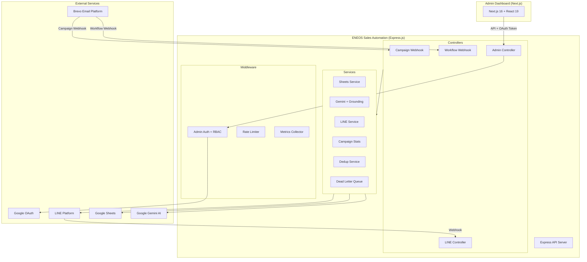

---

## Data Flow Diagrams

### Scenario A: New Lead from Brevo

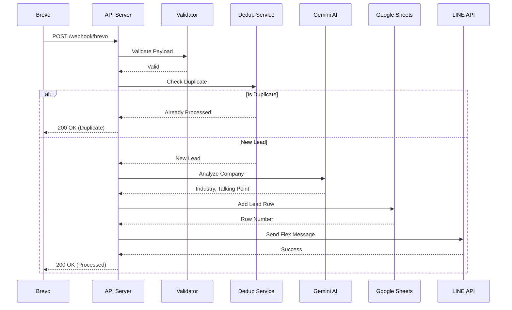

### Scenario B: Sales Action from LINE

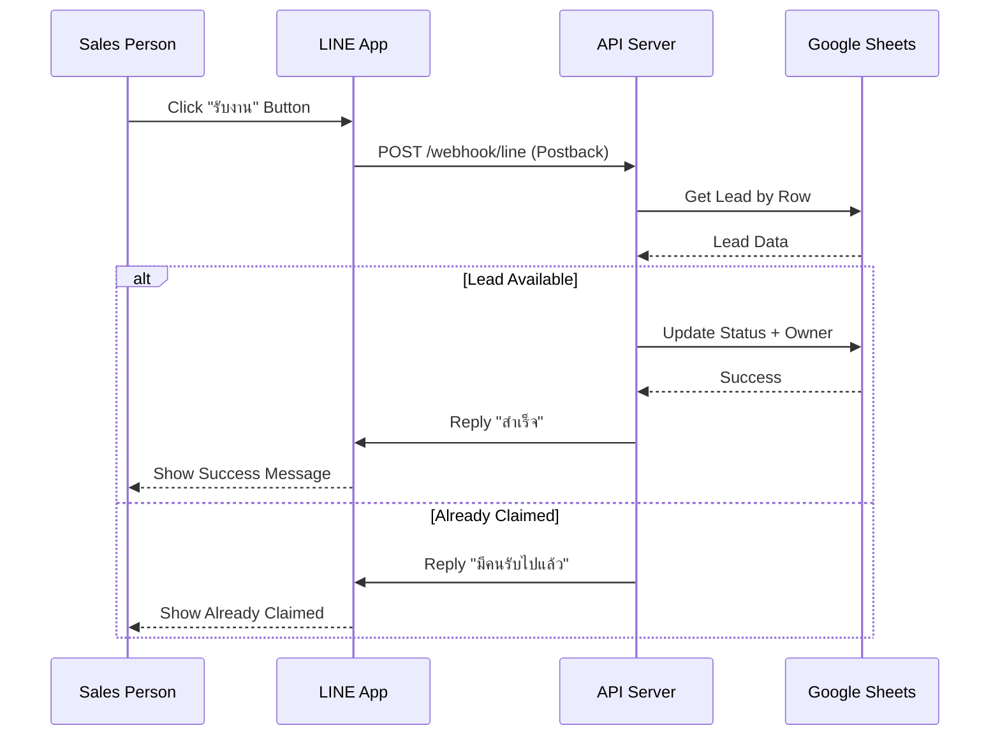

### Scenario C: Campaign Email Events

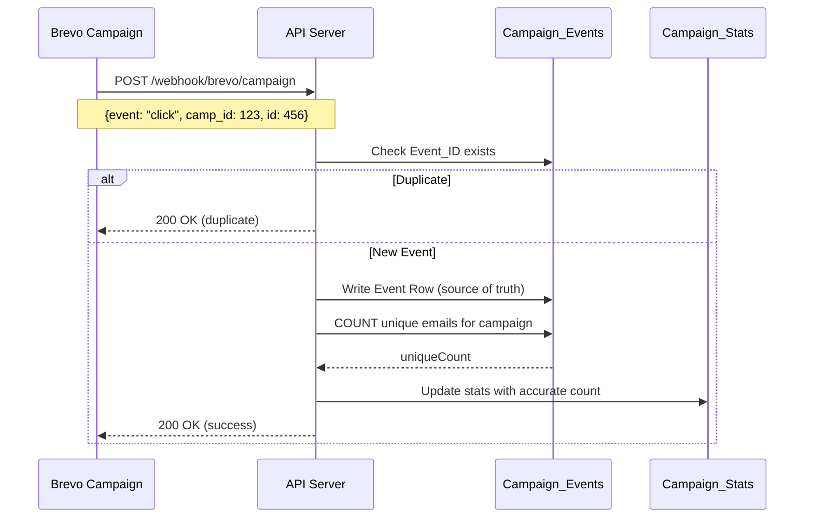

### Background Processing with Status Tracking

**v1.1.0 Feature** - เพิ่ม Background Processing เพื่อลด Webhook Response Time จาก 16s → 0.5s (32x faster)

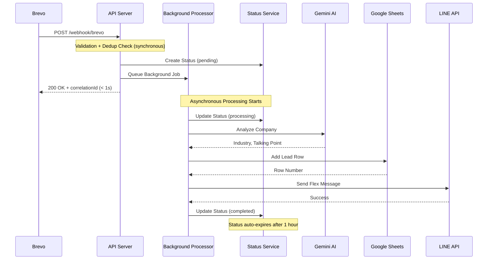

#### Status API Endpoints

Frontend/Client สามารถเช็คสถานะการประมวลผลแบบ Real-time:

**GET /api/leads/status/:correlationId** (Public)
- รับ correlationId จาก webhook response
- ตรวจสอบสถานะ: `pending` → `processing` → `completed` / `failed`
- ไม่ต้อง auth (ใช้ UUID เป็น secret)

**GET /api/leads/status** (Admin Only)
- ดูสถานะทั้งหมดใน memory
- ต้อง admin authentication

#### Background Processing Benefits

| Metric | Before (Sync) | After (Async) | Improvement |
|--------|---------------|---------------|-------------|
| **Response Time** | 16s | 0.5s | **32x faster** |
| **Throughput** | ~4 req/min | ~120 req/min | **40x higher** |
| **Timeout Risk** | High (Brevo 30s limit) | None | **Eliminated** |
| **Cost per Lead** | ~$0.018 | ~$0.005 | **70% cheaper** |
| **User Experience** | 16s wait | Instant feedback | **Significantly better** |

### Race Condition Protection

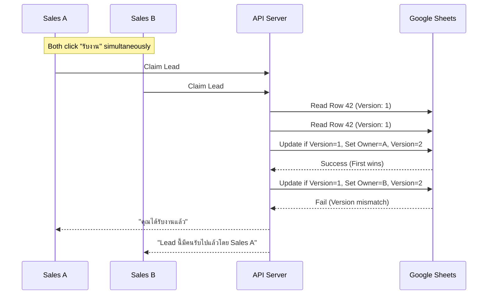

---

## Component Architecture

### Project Structure

```
src/
├── app.ts                 # Main Express application
├── config/
│   ├── index.ts          # Environment config with Zod validation
│   └── swagger.ts        # OpenAPI specification
├── controllers/
│   ├── webhook.controller.ts        # Brevo Workflow webhook
│   ├── campaign-webhook.controller.ts # Brevo Campaign webhook
│   ├── line.controller.ts           # LINE webhook handler
│   ├── admin.controller.ts          # Admin Dashboard API
│   ├── admin/
│   │   ├── campaign-stats.controller.ts # Campaign email metrics
│   │   └── team-management.controller.ts # Team management
│   └── status.controller.ts         # [v1.1.0] Status API handler
├── middleware/
│   ├── admin-auth.ts              # Google OAuth + RBAC
│   ├── error-handler.ts           # Centralized error handling
│   ├── request-context.ts         # Request ID, timeout, timing
│   ├── request-logger.ts          # HTTP request logging
│   └── metrics.middleware.ts      # Prometheus metrics
├── routes/
│   ├── webhook.routes.ts          # /webhook/brevo
│   ├── campaign-webhook.routes.ts # /webhook/brevo/campaign
│   ├── line.routes.ts             # /webhook/line
│   ├── admin.routes.ts            # /api/admin/*
│   └── status.routes.ts           # /api/leads/status
├── services/
│   ├── sheets.service.ts          # Google Sheets CRUD
│   ├── gemini.service.ts          # AI + Google Search Grounding
│   ├── line.service.ts            # LINE messaging
│   ├── campaign-stats.service.ts  # Campaign email metrics
│   ├── deduplication.service.ts   # Prevent duplicates
│   ├── dead-letter-queue.service.ts # Failed events
│   ├── redis.service.ts           # Redis cache (optional)
│   ├── background-processor.service.ts # Async lead processor
│   └── processing-status.service.ts    # Status tracking
├── templates/
│   └── flex-message.ts            # LINE Flex Message templates
├── types/
│   ├── index.ts                   # Core TypeScript interfaces
│   └── admin.types.ts             # Admin Dashboard types
├── utils/
│   ├── logger.ts                  # Winston logger
│   ├── retry.ts                   # Retry + Circuit Breaker
│   ├── metrics.ts                 # Prometheus metrics
│   ├── phone-formatter.ts         # Thai phone formatting
│   ├── email-parser.ts            # Email domain extraction
│   └── date-formatter.ts          # ISO 8601 formatting
├── validators/
│   ├── brevo.validator.ts         # Brevo Workflow validation
│   ├── campaign-event.validator.ts # Brevo Campaign validation
│   └── line.validator.ts          # LINE payload validation
└── constants/
    └── campaign.constants.ts      # Campaign columns, events
```

### Service Dependencies

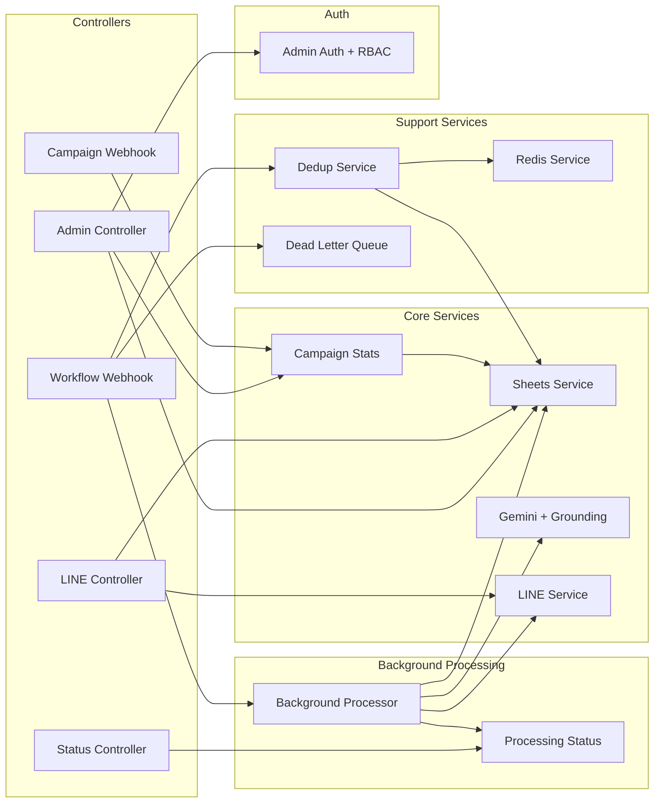

### Admin Dashboard API Architecture

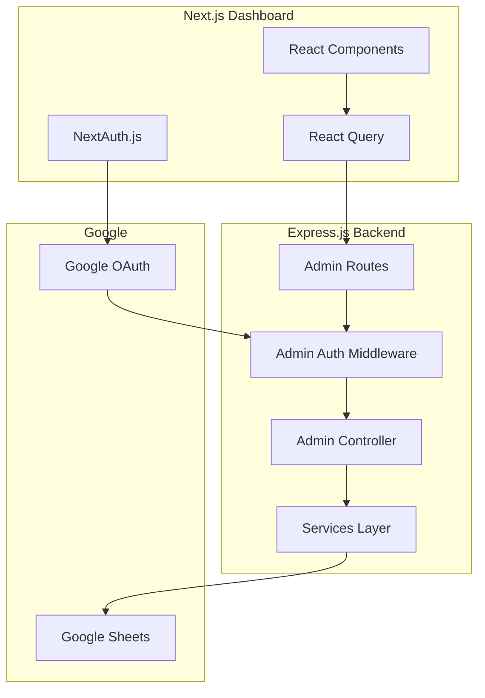

**RBAC (Role-Based Access Control):**

| Role | Sheet Value | Permissions |
|------|-------------|-------------|
| Admin | `admin` | Full access (export, team management) |
| Viewer | `sales` | Read-only access |

---

## Database Schema

### Google Sheets Structure (6 Sheets)

#### Sheet 1: Leads (Main Database) - 34 Columns

| Column | Field | Type | Description |
|--------|-------|------|-------------|
| A | Date | DateTime | วันที่สร้าง Lead |
| B | Customer_Name | String | ชื่อลูกค้า |
| C | Email | String | อีเมล |
| D | Phone | String | เบอร์โทร |
| E | Company | String | ชื่อบริษัท |
| F | Industry_AI | String | อุตสาหกรรม (จาก AI) |
| G | Website | String | เว็บไซต์ |
| H | Capital | String | ทุนจดทะเบียน (Grounding) |
| I | Status | Enum | new/contacted/closed/lost/unreachable |
| J | Sales_Owner_ID | String | LINE User ID ของเซลล์ |
| K | Sales_Owner_Name | String | ชื่อเซลล์ |
| L | Campaign_ID | String | Brevo Campaign ID |
| M | Campaign_Name | String | ชื่อแคมเปญ |
| N | Email_Subject | String | หัวข้ออีเมล |
| O | Source | String | แหล่งที่มา |
| P | Lead_ID | String | Brevo Contact ID |
| Q | Event_ID | String | Brevo Event ID |
| R | Clicked_At | DateTime | เวลาที่คลิก |
| S | Talking_Point | String | จุดขาย (จาก AI) |
| T | Closed_At | DateTime | เวลาปิดการขาย |
| U | Lost_At | DateTime | เวลา Lost |
| V | Unreachable_At | DateTime | เวลาติดต่อไม่ได้ |
| W | Version | Number | Optimistic Lock |
| X | Lead_Source | String | Lead source categorization |
| Y | Job_Title | String | Contact's job title |
| Z | City | String | Contact's city |
| AA | Lead_UUID | String | UUID for Supabase migration |
| AB | Created_At | DateTime | ISO 8601 timestamp |
| AC | Updated_At | DateTime | ISO 8601 timestamp |
| AD | Contacted_At | DateTime | When sales claimed |
| AE | Juristic_ID | String | เลขทะเบียนนิติบุคคล (Grounding) |
| AF | DBD_Sector | String | DBD Sector code (Grounding) |
| AG | Province | String | จังหวัด (Grounding) |
| AH | Full_Address | String | ที่อยู่เต็ม (Grounding) |

#### Sheet 2: Sales_Team - 7 Columns

| Column | Field | Type | Description |
|--------|-------|------|-------------|
| A | LINE_User_ID | String | LINE User ID (nullable for manual members) |
| B | Name | String | ชื่อเซลล์ |
| C | Email | String | @eneos.co.th email |
| D | Phone | String | เบอร์โทร |
| E | Role | String | admin or sales |
| F | Created_At | DateTime | ISO 8601 timestamp |
| G | Status | String | active or inactive |

#### Sheet 3: Status_History (Audit Log) - 6 Columns

| Column | Field | Type | Description |
|--------|-------|------|-------------|
| A | Lead_UUID | String | Reference to Leads.Lead_UUID |
| B | Status | Enum | Status at this point |
| C | Changed_By_ID | String | LINE User ID or "System" |
| D | Changed_By_Name | String | Who made the change |
| E | Timestamp | DateTime | ISO 8601 timestamp |
| F | Notes | String | Optional notes |

#### Sheet 4: Deduplication_Log - 4 Columns

| Column | Field | Type | Description |
|--------|-------|------|-------------|
| A | Key | String | `${email}:${campaignId}` |
| B | Email | String | อีเมล |
| C | Campaign_ID | String | Campaign ID |
| D | Processed_At | DateTime | เวลา process |

#### Sheet 5: Campaign_Events - 11 Columns

| Column | Field | Type | Description |
|--------|-------|------|-------------|
| A | Event_ID | Number | Unique event ID (PK) |
| B | Campaign_ID | Number | Brevo campaign ID |
| C | Campaign_Name | String | Campaign name |
| D | Email | String | Recipient email |
| E | Event | String | delivered/opened/click |
| F | Event_At | DateTime | Event timestamp |
| G | Sent_At | DateTime | Email sent timestamp |
| H | URL | String | Clicked URL |
| I | Tag | String | Brevo tag |
| J | Segment_IDs | String | Brevo segment IDs |
| K | Created_At | DateTime | Row creation time |

#### Sheet 6: Campaign_Stats - 15 Columns

| Column | Field | Type | Description |
|--------|-------|------|-------------|
| A | Campaign_ID | Number | Brevo campaign ID (PK) |
| B | Campaign_Name | String | Campaign name |
| C | Delivered | Number | Total delivered |
| D | Opened | Number | Total opens |
| E | Clicked | Number | Total clicks |
| F | Unique_Opens | Number | Unique openers |
| G | Unique_Clicks | Number | Unique clickers |
| H | Open_Rate | Number | Unique_Opens / Delivered * 100 |
| I | Click_Rate | Number | Unique_Clicks / Delivered * 100 |
| J | Hard_Bounce | Number | (Future) |
| K | Soft_Bounce | Number | (Future) |
| L | Unsubscribe | Number | (Future) |
| M | Spam | Number | (Future) |
| N | First_Event | DateTime | First event timestamp |
| O | Last_Updated | DateTime | Last update timestamp |

---

## Security Architecture

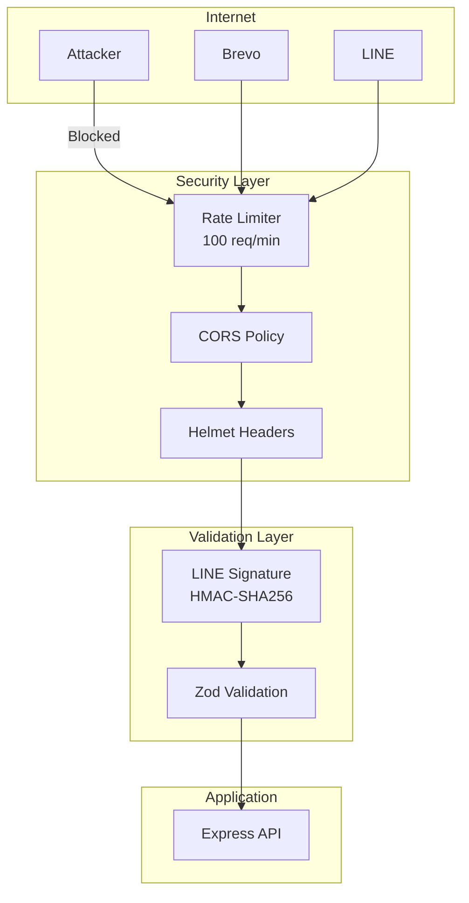

### Security Measures

| Layer | Protection | Implementation |
|-------|------------|----------------|
| Transport | HTTPS | Railway/Cloud Platform |
| Headers | Security Headers | Helmet.js |
| Rate Limit | DoS Protection | express-rate-limit |
| Validation | Input Validation | Zod schemas |
| Auth | LINE Signature | HMAC-SHA256 verification |
| Data | SQL Injection | N/A (Google Sheets API) |

---

## Error Handling

### Error Flow

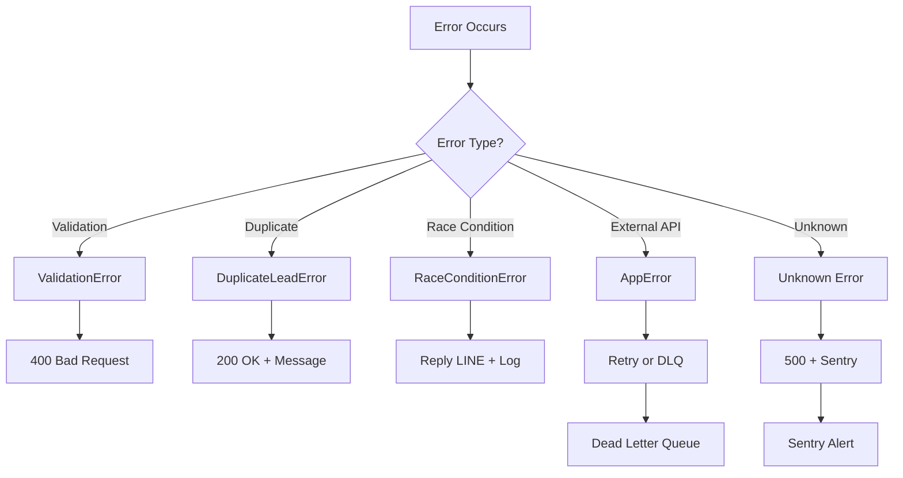

### Dead Letter Queue

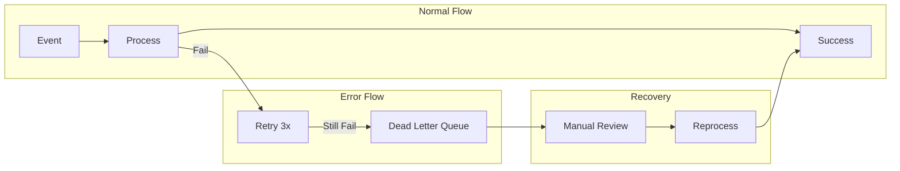

---

## Monitoring & Observability

### Metrics Architecture

```mermaid
graph LR
    subgraph Application
        API[Express API]
        MC[Metrics Collector]
    end

    subgraph Endpoints
        PM[/metrics<br/>Prometheus Format]
        PS[/metrics/summary<br/>JSON Format]
        H[/health<br/>Service Health]
    end

    subgraph External
        Prom[Prometheus]
        Graf[Grafana]
        Alert[Alert Manager]
    end

    API --> MC
    MC --> PM
    MC --> PS
    API --> H

    PM --> Prom
    Prom --> Graf
    Prom --> Alert
```

### Available Metrics

| Metric | Type | Description |
|--------|------|-------------|
| `http_requests_total` | Counter | Total HTTP requests |
| `http_request_duration_seconds` | Histogram | Request latency |
| `leads_processed_total` | Counter | Leads processed |
| `leads_claimed_total` | Counter | Leads claimed by sales |
| `duplicate_leads_total` | Counter | Duplicate leads detected |
| `race_conditions_total` | Counter | Race conditions detected |
| `ai_analysis_duration_seconds` | Histogram | AI analysis latency |
| `line_notification_total` | Counter | LINE notifications sent |
| `dead_letter_queue_size` | Gauge | DLQ current size |

### Health Check Response

```json
{
  "status": "healthy",
  "timestamp": "2026-01-11T12:00:00.000Z",
  "version": "1.0.0",
  "services": {
    "googleSheets": { "status": "up", "latency": 150 },
    "geminiAI": { "status": "up", "latency": 500 },
    "lineAPI": { "status": "up", "latency": 100 }
  }
}
```

---

## Appendix

### Environment Variables

See [.env.example](.env.example) for complete list.

### API Documentation

See [/api-docs](https://eneos-sales-automation-production.up.railway.app/api-docs) for OpenAPI/Swagger documentation.

### Related Documents

- [README.md](README.md) - Quick Start Guide
- [DEPLOYMENT.md](DEPLOYMENT.md) - Deployment Instructions
- [CLAUDE.md](CLAUDE.md) - AI Assistant Context
- [docs/](docs/) - Detailed Documentation
