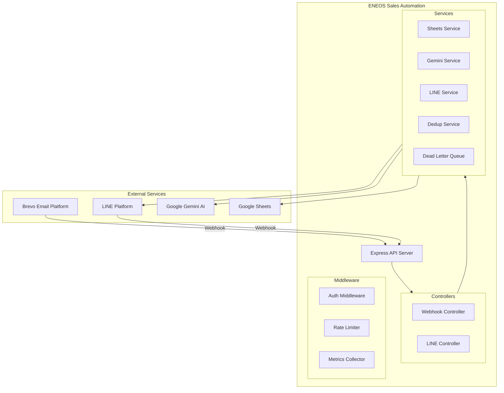
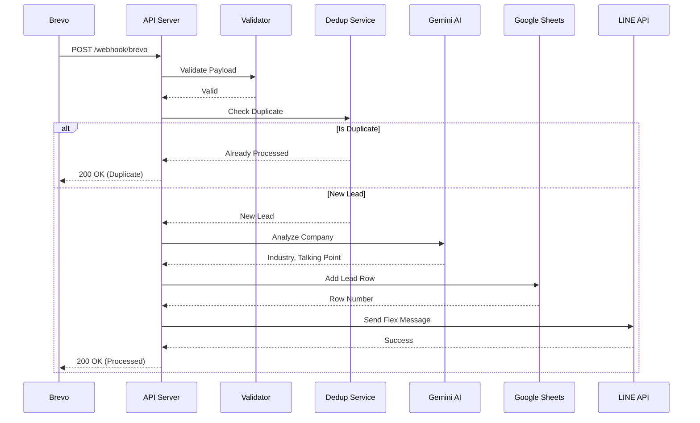
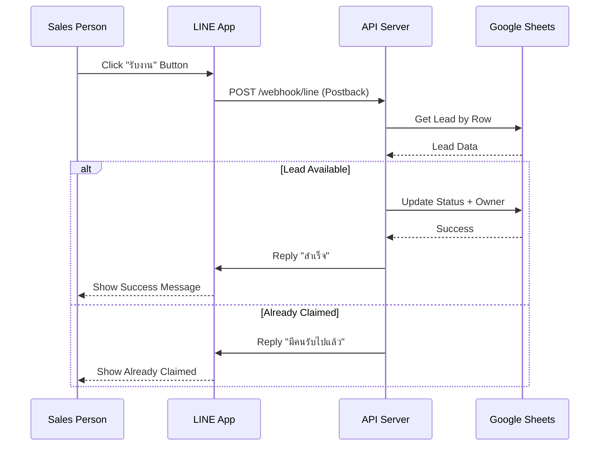
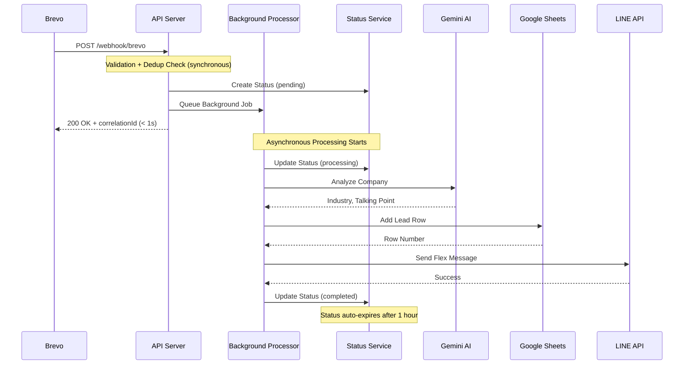
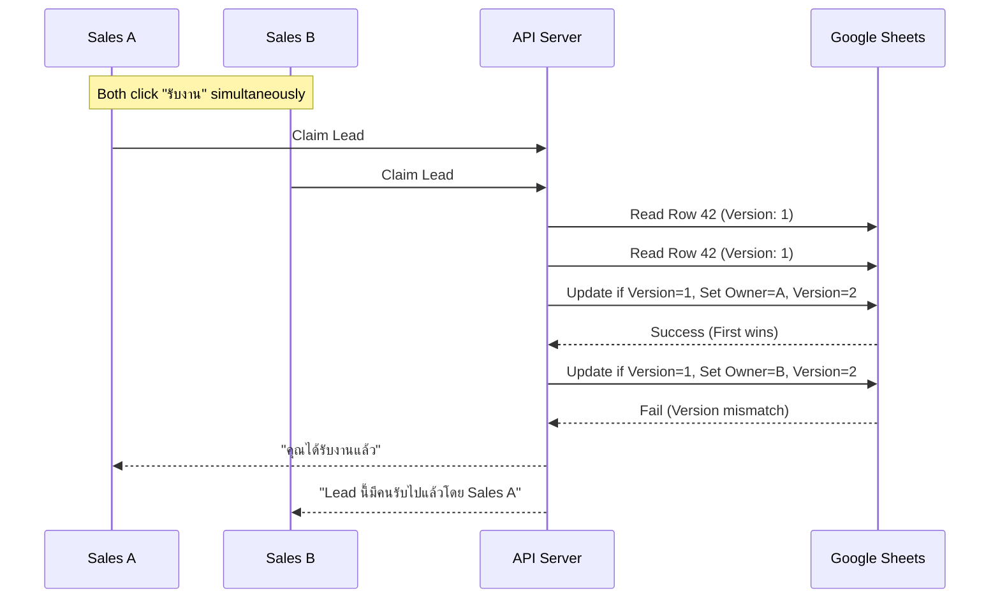
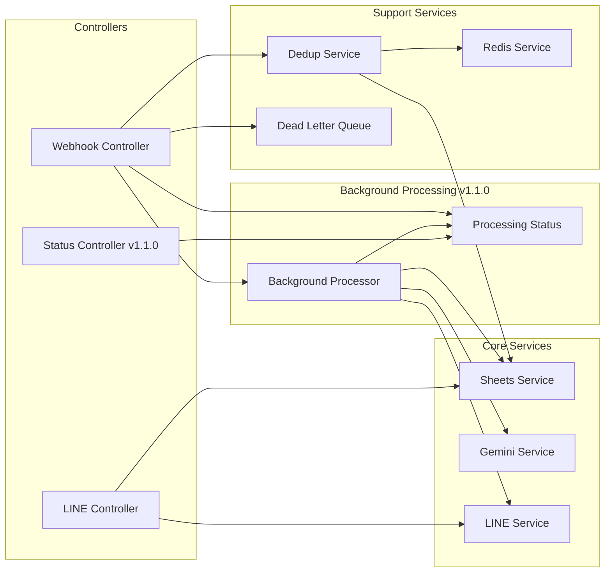
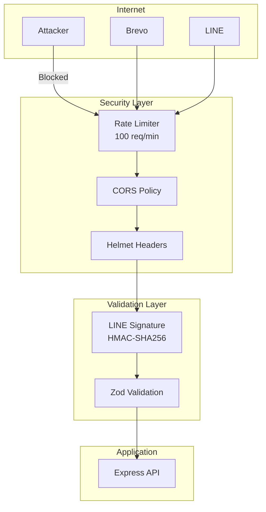
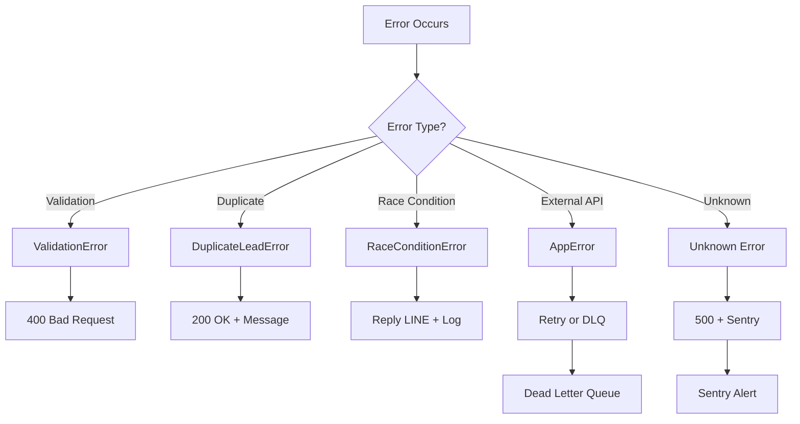
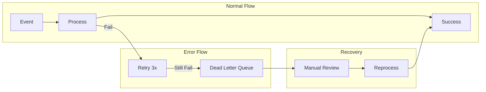

# ENEOS Sales Automation - Architecture

> Enterprise-grade Sales Automation System for ENEOS Thailand

## Table of Contents

- [System Overview](#system-overview)
- [High-Level Architecture](#high-level-architecture)
- [Data Flow Diagrams](#data-flow-diagrams)
- [Component Architecture](#component-architecture)
- [Database Schema](#database-schema)
- [Security Architecture](#security-architecture)
- [Error Handling](#error-handling)
- [Monitoring & Observability](#monitoring--observability)

---

## System Overview

### Purpose
ระบบ Sales Automation ที่รับ Lead จาก Email Campaign (Brevo) วิเคราะห์ด้วย AI และแจ้งเตือนทีมขายผ่าน LINE OA พร้อมระบบป้องกัน Race Condition

### Key Features
- **Webhook Integration** - รับ events จาก Brevo และ LINE
- **AI Enrichment** - วิเคราะห์ข้อมูลบริษัทด้วย Gemini AI
- **Real-time Notifications** - แจ้งเตือนผ่าน LINE Flex Message
- **Race Condition Protection** - ป้องกันการแย่งงานระหว่างเซลล์
- **Deduplication** - ป้องกัน Lead ซ้ำซ้อน

### Tech Stack
| Layer | Technology |
|-------|------------|
| Runtime | Node.js 20+ |
| Language | TypeScript 5.x |
| Framework | Express.js 4.x |
| Database | Google Sheets API |
| AI | Google Gemini 1.5 Flash |
| Messaging | LINE Messaging API |
| Cache | Redis (optional) / In-Memory |
| Monitoring | Prometheus + Custom Metrics |

---

## High-Level Architecture



---

## Data Flow Diagrams

### Scenario A: New Lead from Brevo



### Scenario B: Sales Action from LINE



### Background Processing with Status Tracking

**v1.1.0 Feature** - เพิ่ม Background Processing เพื่อลด Webhook Response Time จาก 16s → 0.5s (32x faster)



#### Status API Endpoints

Frontend/Client สามารถเช็คสถานะการประมวลผลแบบ Real-time:

**GET /api/leads/status/:correlationId** (Public)
- รับ correlationId จาก webhook response
- ตรวจสอบสถานะ: `pending` → `processing` → `completed` / `failed`
- ไม่ต้อง auth (ใช้ UUID เป็น secret)

**GET /api/leads/status** (Admin Only)
- ดูสถานะทั้งหมดใน memory
- ต้อง admin authentication

#### Background Processing Benefits

| Metric | Before (Sync) | After (Async) | Improvement |
|--------|---------------|---------------|-------------|
| **Response Time** | 16s | 0.5s | **32x faster** |
| **Throughput** | ~4 req/min | ~120 req/min | **40x higher** |
| **Timeout Risk** | High (Brevo 30s limit) | None | **Eliminated** |
| **Cost per Lead** | ~$0.018 | ~$0.005 | **70% cheaper** |
| **User Experience** | 16s wait | Instant feedback | **Significantly better** |

### Race Condition Protection



---

## Component Architecture

### Project Structure

```
src/
├── app.ts                 # Main Express application
├── config/
│   ├── index.ts          # Environment config with Zod validation
│   └── swagger.ts        # OpenAPI specification
├── controllers/
│   ├── webhook.controller.ts   # Brevo webhook handler
│   ├── line.controller.ts      # LINE webhook handler
│   └── status.controller.ts    # [v1.1.0] Status API handler
├── middleware/
│   ├── error-handler.ts        # Centralized error handling
│   ├── request-context.ts      # Request ID, timeout, timing
│   ├── request-logger.ts       # HTTP request logging
│   └── metrics.middleware.ts   # Prometheus metrics
├── routes/
│   ├── webhook.routes.ts       # /webhook/brevo
│   ├── line.routes.ts          # /webhook/line
│   └── status.routes.ts        # [v1.1.0] /api/leads/status
├── services/
│   ├── sheets.service.ts       # Google Sheets CRUD
│   ├── gemini.service.ts       # AI company analysis
│   ├── line.service.ts         # LINE messaging
│   ├── deduplication.service.ts # Prevent duplicates
│   ├── dead-letter-queue.service.ts # Failed events
│   ├── redis.service.ts        # Redis cache (optional)
│   ├── background-processor.service.ts # [v1.1.0] Async lead processor
│   └── processing-status.service.ts   # [v1.1.0] Status tracking
├── templates/
│   └── flex-message.ts         # LINE Flex Message templates
├── types/
│   └── index.ts               # TypeScript interfaces
├── utils/
│   ├── logger.ts              # Winston logger
│   ├── retry.ts               # Retry + Circuit Breaker
│   ├── metrics.ts             # Prometheus metrics
│   ├── phone-formatter.ts     # Thai phone formatting
│   └── email-parser.ts        # Email domain extraction
└── validators/
    ├── brevo.validator.ts     # Brevo payload validation
    └── line.validator.ts      # LINE payload validation
```

### Service Dependencies



---

## Database Schema

### Google Sheets Structure

#### Sheet 1: Leads (Main Database)

| Column | Field | Type | Description |
|--------|-------|------|-------------|
| A | Date | DateTime | วันที่สร้าง Lead |
| B | Customer Name | String | ชื่อลูกค้า |
| C | Email | String | อีเมล |
| D | Phone | String | เบอร์โทร |
| E | Company | String | ชื่อบริษัท |
| F | Industry_AI | String | อุตสาหกรรม (จาก AI) |
| G | Website | String | เว็บไซต์ |
| H | Capital | String | ทุนจดทะเบียน |
| I | Status | Enum | new/contacted/closed/lost/unreachable |
| J | Sales_Owner_ID | String | LINE User ID ของเซลล์ |
| K | Sales_Owner_Name | String | ชื่อเซลล์ |
| L | Campaign_ID | String | Brevo Campaign ID |
| M | Campaign_Name | String | ชื่อแคมเปญ |
| N | Email_Subject | String | หัวข้ออีเมล |
| O | Source | String | แหล่งที่มา |
| P | Lead_ID | String | Unique Lead ID |
| Q | Event_ID | String | Brevo Event ID |
| R | Clicked_At | DateTime | เวลาที่คลิก |
| S | Talking_Point | String | จุดขาย (จาก AI) |
| T | Closed_At | DateTime | เวลาปิดการขาย |
| U | Lost_At | DateTime | เวลา Lost |
| V | Unreachable_At | DateTime | เวลาติดต่อไม่ได้ |
| W | Version | Number | Optimistic Lock |

#### Sheet 2: Deduplication_Log

| Column | Field | Type | Description |
|--------|-------|------|-------------|
| A | Key | String | `${email}:${campaignId}` |
| B | Email | String | อีเมล |
| C | Campaign_ID | String | Campaign ID |
| D | Processed_At | DateTime | เวลา process |

#### Sheet 3: Sales_Team

| Column | Field | Type | Description |
|--------|-------|------|-------------|
| A | LINE_User_ID | String | LINE User ID |
| B | Name | String | ชื่อเซลล์ |
| C | Email | String | อีเมล |
| D | Phone | String | เบอร์โทร |

---

## Security Architecture



### Security Measures

| Layer | Protection | Implementation |
|-------|------------|----------------|
| Transport | HTTPS | Railway/Cloud Platform |
| Headers | Security Headers | Helmet.js |
| Rate Limit | DoS Protection | express-rate-limit |
| Validation | Input Validation | Zod schemas |
| Auth | LINE Signature | HMAC-SHA256 verification |
| Data | SQL Injection | N/A (Google Sheets API) |

---

## Error Handling

### Error Flow



### Dead Letter Queue



---

## Monitoring & Observability

### Metrics Architecture

```mermaid
graph LR
    subgraph Application
        API[Express API]
        MC[Metrics Collector]
    end

    subgraph Endpoints
        PM[/metrics<br/>Prometheus Format]
        PS[/metrics/summary<br/>JSON Format]
        H[/health<br/>Service Health]
    end

    subgraph External
        Prom[Prometheus]
        Graf[Grafana]
        Alert[Alert Manager]
    end

    API --> MC
    MC --> PM
    MC --> PS
    API --> H

    PM --> Prom
    Prom --> Graf
    Prom --> Alert
```

### Available Metrics

| Metric | Type | Description |
|--------|------|-------------|
| `http_requests_total` | Counter | Total HTTP requests |
| `http_request_duration_seconds` | Histogram | Request latency |
| `leads_processed_total` | Counter | Leads processed |
| `leads_claimed_total` | Counter | Leads claimed by sales |
| `duplicate_leads_total` | Counter | Duplicate leads detected |
| `race_conditions_total` | Counter | Race conditions detected |
| `ai_analysis_duration_seconds` | Histogram | AI analysis latency |
| `line_notification_total` | Counter | LINE notifications sent |
| `dead_letter_queue_size` | Gauge | DLQ current size |

### Health Check Response

```json
{
  "status": "healthy",
  "timestamp": "2026-01-11T12:00:00.000Z",
  "version": "1.0.0",
  "services": {
    "googleSheets": { "status": "up", "latency": 150 },
    "geminiAI": { "status": "up", "latency": 500 },
    "lineAPI": { "status": "up", "latency": 100 }
  }
}
```

---

## Appendix

### Environment Variables

See [.env.example](.env.example) for complete list.

### API Documentation

See [/api-docs](https://eneos-sales-automation-production.up.railway.app/api-docs) for OpenAPI/Swagger documentation.

### Related Documents

- [README.md](README.md) - Quick Start Guide
- [DEPLOYMENT.md](DEPLOYMENT.md) - Deployment Instructions
- [CLAUDE.md](CLAUDE.md) - AI Assistant Context
- [docs/](docs/) - Detailed Documentation
