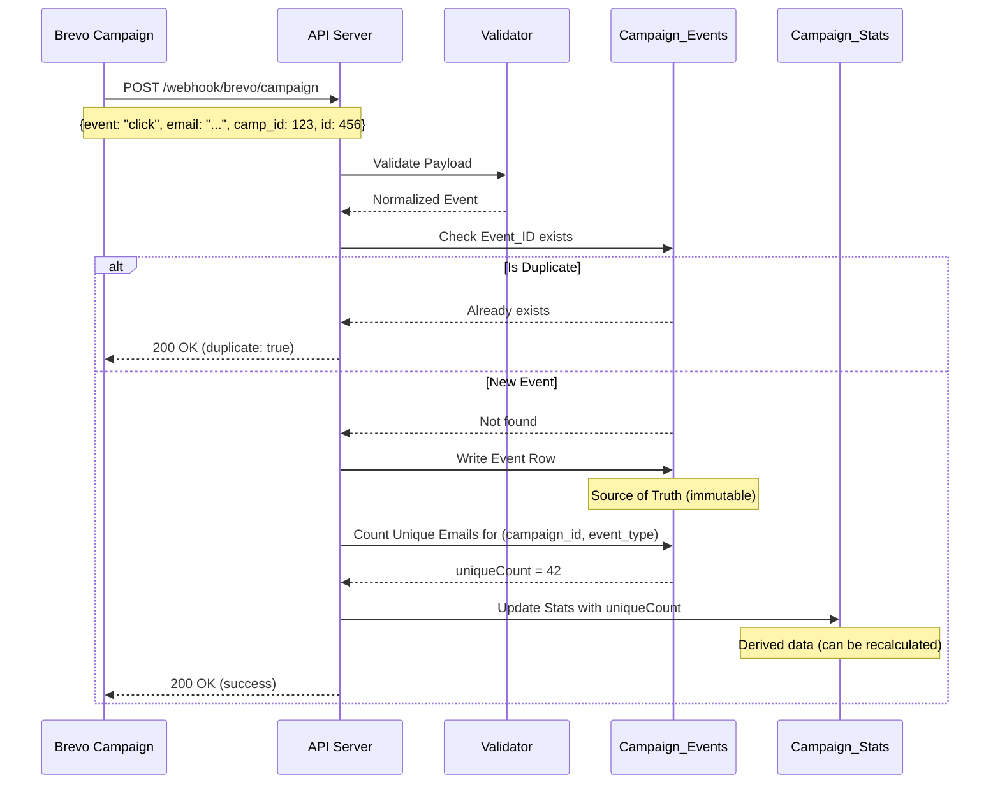
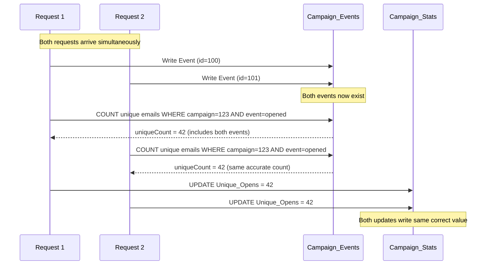

# Data Flow Documentation

> รายละเอียด Flow การทำงานของระบบ ENEOS Sales Automation

## Overview

ระบบมี 4 Scenarios หลัก:
1. **Scenario A** - รับ Lead ใหม่จาก Brevo Workflow Automation
2. **Scenario B** - Sales กดรับงาน/อัปเดตสถานะผ่าน LINE
3. **Scenario C** - รับ Email Events จาก Brevo Campaign (delivered/opened/click)
4. **Scenario D** - Admin Dashboard API (ดึงข้อมูล/Export)

---

## Scenario A: New Lead from Brevo

### Flow Diagram

```
┌─────────────┐     ┌─────────────┐     ┌─────────────┐
│   Brevo     │────▶│  Validator  │────▶│   Dedup     │
│  Webhook    │     │   (Zod)     │     │  Service    │
└─────────────┘     └─────────────┘     └──────┬──────┘
                                               │
                    ┌──────────────────────────┼──────────────────────────┐
                    │                          │                          │
                    ▼                          ▼                          ▼
              ┌───────────┐            ┌───────────────┐          ┌────────────┐
              │ Duplicate │            │  Gemini AI    │          │   Sheets   │
              │  Return   │            │  Analysis     │          │   Add Row  │
              └───────────┘            └───────┬───────┘          └─────┬──────┘
                                               │                        │
                                               └────────────┬───────────┘
                                                            │
                                                            ▼
                                                    ┌───────────────┐
                                                    │  LINE Send    │
                                                    │  Flex Message │
                                                    └───────────────┘
```

### Step-by-Step

| Step | Component | Action | Error Handling |
|------|-----------|--------|----------------|
| 1 | Webhook Controller | รับ POST /webhook/brevo | Return 400 if invalid |
| 2 | Brevo Validator | Validate payload with Zod | Return validation errors |
| 3 | Event Filter | Check if event = "click" | Acknowledge non-click events |
| 4 | Dedup Service | Check email + campaignId | Return if duplicate |
| 5 | Gemini Service | Analyze company domain | Fallback to defaults |
| 6 | Sheets Service | Add new row to Leads sheet | Retry 3x, then DLQ |
| 7 | LINE Service | Send Flex Message to group | Retry 3x, then DLQ |
| 8 | Response | Return success + row number | - |

### Data Transformation

```
Brevo Webhook Payload
        │
        ▼
┌───────────────────────────────────────┐
│ {                                     │
│   "event": "click",                   │
│   "email": "customer@company.com",    │
│   "FIRSTNAME": "John",                │
│   "LASTNAME": "Doe",                  │
│   "PHONE": "0812345678",              │
│   "COMPANY": "ACME Corp",             │
│   "campaign_id": 12345,               │
│   "campaign_name": "ENEOS Oil 2024",  │
│   "subject": "Special Offer"          │
│ }                                     │
└───────────────────────────────────────┘
        │
        │ + AI Analysis
        ▼
┌───────────────────────────────────────┐
│ {                                     │
│   industry: "Manufacturing",          │
│   companyType: "B2B",                 │
│   talkingPoint: "เหมาะกับน้ำมัน...",   │
│   website: "https://acme.com",        │
│   registeredCapital: "10M THB"        │
│ }                                     │
└───────────────────────────────────────┘
        │
        │ Merge & Save
        ▼
┌───────────────────────────────────────┐
│ Google Sheets Row:                    │
│ [Date, John Doe, customer@company.com,│
│  0812345678, ACME Corp, Manufacturing,│
│  https://acme.com, 10M THB, new,      │
│  null, null, 12345, ENEOS Oil 2024,   │
│  Special Offer, Brevo, lead-123, ...]│
└───────────────────────────────────────┘
```

---

## Scenario B: Sales Action from LINE

### Flow Diagram

```
┌─────────────┐     ┌─────────────┐     ┌─────────────┐
│   LINE      │────▶│  Signature  │────▶│  Validator  │
│  Postback   │     │  Verify     │     │   (Zod)     │
└─────────────┘     └─────────────┘     └──────┬──────┘
                                               │
                                               ▼
                                       ┌───────────────┐
                                       │ Parse Action  │
                                       │ & Row ID      │
                                       └───────┬───────┘
                                               │
                    ┌──────────────────────────┼──────────────────────────┐
                    │                          │                          │
                    ▼                          ▼                          ▼
            ┌───────────────┐          ┌───────────────┐          ┌───────────────┐
            │ action=       │          │ action=       │          │ action=       │
            │ contacted     │          │ closed/lost   │          │ unreachable   │
            └───────┬───────┘          └───────┬───────┘          └───────┬───────┘
                    │                          │                          │
                    ▼                          ▼                          ▼
            ┌───────────────┐          ┌───────────────┐          ┌───────────────┐
            │ Claim Lead    │          │ Update Status │          │ Mark          │
            │ (Race Check)  │          │ (Owner Only)  │          │ Unreachable   │
            └───────────────┘          └───────────────┘          └───────────────┘
                    │                          │                          │
                    └──────────────────────────┼──────────────────────────┘
                                               │
                                               ▼
                                       ┌───────────────┐
                                       │  LINE Reply   │
                                       │  Message      │
                                       └───────────────┘
```

### Action: contacted (รับงาน)

```mermaid
sequenceDiagram
    participant S as Sales
    participant API as API
    participant DB as Sheets

    S->>API: action=contacted&row_id=42
    API->>DB: Get Row 42
    DB-->>API: Lead Data (Owner=null, Version=1)

    alt Lead Available
        API->>DB: Update Row 42<br/>Set Owner=Sales, Version=2
        DB-->>API: Success
        API->>S: Reply "คุณได้รับ Lead แล้ว"
    else Already Claimed
        API->>S: Reply "Lead นี้มีคนรับไปแล้ว"
    end
```



### Action: closed (ปิดการขาย)

```mermaid
sequenceDiagram
    participant S as Sales
    participant API as API
    participant DB as Sheets

    S->>API: action=closed&row_id=42
    API->>DB: Get Row 42
    DB-->>API: Lead Data (Owner=Sales)

    alt Is Owner
        API->>DB: Update Status=closed, Closed_At=now
        DB-->>API: Success
        API->>S: Reply "ปิดการขายสำเร็จ"
    else Not Owner
        API->>S: Reply "คุณไม่ใช่เจ้าของ Lead นี้"
    end
```



---

## Scenario C: Email Marketing Events (Brevo Campaign)

> POST /webhook/brevo/campaign - รับ events จาก Brevo Email Campaign

### Flow Diagram

```
┌─────────────────┐     ┌─────────────┐     ┌─────────────┐
│   Brevo Email   │────▶│  Validator  │────▶│  Dedup by   │
│   Campaign      │     │   (Zod)     │     │  Event_ID   │
└─────────────────┘     └─────────────┘     └──────┬──────┘
                                                   │
                        ┌──────────────────────────┼──────────────────────────┐
                        │                          │                          │
                        ▼                          ▼                          ▼
                  ┌───────────┐            ┌───────────────┐          ┌────────────┐
                  │ Duplicate │            │ Write Event   │          │  Count     │
                  │  Return   │            │ to Events     │          │  Unique    │
                  └───────────┘            └───────┬───────┘          └─────┬──────┘
                                                   │                        │
                                                   └────────────┬───────────┘
                                                                │
                                                                ▼
                                                        ┌───────────────┐
                                                        │ Update Stats  │
                                                        │ (Aggregate)   │
                                                        └───────────────┘
```

### Sequence Diagram



### Supported Events

| Event | Action | Stats Updated |
|-------|--------|---------------|
| `delivered` | Write event + count unique | Delivered, Unique_Opens (0) |
| `opened` | Write event + count unique opens | Opened, Unique_Opens |
| `click` | Write event + count unique clicks + store URL | Clicked, Unique_Clicks |
| `hard_bounce` | Acknowledge only | (Future) |
| `soft_bounce` | Acknowledge only | (Future) |
| `unsubscribe` | Acknowledge only | (Future) |
| `spam` | Acknowledge only | (Future) |

### Count-after-Write Pattern (Race Condition Fix)

```
❌ Wrong: Read count → Increment → Write
   Problem: Two concurrent requests both read count=5, both write count=6

✅ Correct: Write event → Count from sheet → Write stats
   Solution: Event is already written, count always reflects reality
```



### Data Transformation

```
Brevo Campaign Webhook
        │
        ▼
┌───────────────────────────────────────┐
│ {                                     │
│   "event": "click",                   │
│   "email": "customer@company.com",    │
│   "camp_id": 123,                     │
│   "campaign name": "ENEOS Q1 2024",   │
│   "id": 456,                          │
│   "URL": "https://example.com/link",  │
│   "date_event": "2026-01-30 10:00:00",│
│   "date_sent": "2026-01-30 09:00:00", │
│   "tag": "promo"                      │
│ }                                     │
└───────────────────────────────────────┘
        │
        │ Normalize
        ▼
┌───────────────────────────────────────┐
│ Campaign_Events Row:                  │
│ [456, 123, "ENEOS Q1 2024",           │
│  "customer@company.com", "click",     │
│  "2026-01-30T10:00:00Z", ...]        │
└───────────────────────────────────────┘
        │
        │ Aggregate
        ▼
┌───────────────────────────────────────┐
│ Campaign_Stats Update:                │
│ Clicked = Clicked + 1                 │
│ Unique_Clicks = COUNT(DISTINCT email) │
│ Click_Rate = Unique_Clicks/Delivered  │
└───────────────────────────────────────┘
```

---

## Scenario D: Admin Dashboard API

> GET /api/admin/* - Admin Dashboard data retrieval

### Flow Diagram

```
┌─────────────────┐     ┌─────────────┐     ┌─────────────┐
│   Next.js       │────▶│  Admin Auth │────▶│  Role Check │
│   Dashboard     │     │  Middleware │     │  (RBAC)     │
└─────────────────┘     └─────────────┘     └──────┬──────┘
                                                   │
                        ┌──────────────────────────┼──────────────────────────┐
                        │                          │                          │
                        ▼                          ▼                          ▼
                  ┌───────────┐            ┌───────────────┐          ┌────────────┐
                  │ 403       │            │ Admin         │          │ Viewer     │
                  │ Forbidden │            │ Full Access   │          │ Read Only  │
                  └───────────┘            └───────────────┘          └────────────┘
```

### Authentication Flow

```mermaid
sequenceDiagram
    participant D as Dashboard
    participant API as Backend API
    participant G as Google OAuth
    participant S as Sales_Team Sheet

    D->>API: GET /api/admin/dashboard
    Note over D,API: Authorization: Bearer <id_token>

    API->>G: Verify ID Token
    G-->>API: {email, name, sub}

    alt Invalid Token
        API-->>D: 401 INVALID_TOKEN
    else Valid Token
        API->>API: Check domain = @eneos.co.th
        alt Wrong Domain
            API-->>D: 403 FORBIDDEN_DOMAIN
        else Valid Domain
            API->>S: Query role by email
            S-->>API: {role: "admin" | "sales"}

            alt Inactive Status
                API-->>D: 403 ACCOUNT_INACTIVE
            else Active
                Note over API: Map "sales" → "viewer"
                API->>API: Attach req.user = {email, name, role}
                API-->>D: 200 OK + data
            end
        end
    end
```



---

## Race Condition Protection

### Problem

```
┌──────────────┐                              ┌──────────────┐
│   Sales A    │                              │   Sales B    │
└──────┬───────┘                              └──────┬───────┘
       │                                             │
       │ Click "รับงาน" (Row 42)                      │ Click "รับงาน" (Row 42)
       │                                             │
       ▼                                             ▼
┌──────────────────────────────────────────────────────────────┐
│                      API Server                              │
│                                                              │
│  Request A: Get Row 42 ──────────────────▶ Owner=null, V=1   │
│  Request B: Get Row 42 ──────────────────▶ Owner=null, V=1   │
│                                                              │
│  Without protection, both would succeed!                     │
└──────────────────────────────────────────────────────────────┘
```

### Solution: Optimistic Locking

```
┌──────────────┐                              ┌──────────────┐
│   Sales A    │                              │   Sales B    │
└──────┬───────┘                              └──────┬───────┘
       │                                             │
       ▼                                             ▼
┌──────────────────────────────────────────────────────────────┐
│                      API Server                              │
│                                                              │
│  1. Get Row 42 ──────▶ Owner=null, Version=1                 │
│  2. Get Row 42 ──────▶ Owner=null, Version=1                 │
│                                                              │
│  3. Update WHERE Version=1                                   │
│     Set Owner=A, Version=2 ──────▶ ✅ Success (First wins)   │
│                                                              │
│  4. Update WHERE Version=1                                   │
│     Set Owner=B, Version=2 ──────▶ ❌ Fail (Version changed) │
│                                                              │
└──────────────────────────────────────────────────────────────┘
       │                                             │
       ▼                                             ▼
  "คุณได้รับงานแล้ว"                        "Lead นี้มีคนรับไปแล้ว"
```

### Implementation

```typescript
async claimLead(rowNumber: number, userId: string, userName: string) {
  // 1. Read current state
  const lead = await this.getRow(rowNumber);

  // 2. Check if already claimed
  if (lead.salesOwnerId) {
    throw new RaceConditionError(lead.salesOwnerName);
  }

  // 3. Update with version check (atomic)
  const currentVersion = lead.version || 0;
  const success = await this.updateWithVersionCheck(
    rowNumber,
    { salesOwnerId: userId, salesOwnerName: userName },
    currentVersion
  );

  // 4. Handle conflict
  if (!success) {
    const freshLead = await this.getRow(rowNumber);
    throw new RaceConditionError(freshLead.salesOwnerName);
  }
}
```

---

## Deduplication Flow

### Check Process

```
┌─────────────────────────────────────────────────────────────┐
│                    Deduplication Check                       │
├─────────────────────────────────────────────────────────────┤
│                                                              │
│  1. Generate Key: `${email.toLowerCase()}:${campaignId}`     │
│                                                              │
│  2. Check Memory Cache (LRU, 1000 items, 24h TTL)            │
│     ├── HIT ──────────────▶ Return: Duplicate                │
│     └── MISS ─────────────▶ Continue                         │
│                                                              │
│  3. Check Redis (if available)                               │
│     ├── HIT ──────────────▶ Return: Duplicate                │
│     └── MISS ─────────────▶ Continue                         │
│                                                              │
│  4. Check Google Sheets (Deduplication_Log)                  │
│     ├── FOUND ────────────▶ Add to Cache, Return: Duplicate  │
│     └── NOT FOUND ────────▶ Continue                         │
│                                                              │
│  5. Mark as Processed                                        │
│     ├── Add to Memory Cache                                  │
│     ├── Add to Redis (if available)                          │
│     └── Add to Google Sheets                                 │
│                                                              │
│  6. Return: New Lead                                         │
│                                                              │
└─────────────────────────────────────────────────────────────┘
```

---

## Error Recovery Flow

### Dead Letter Queue

```
┌─────────────────────────────────────────────────────────────┐
│                    Error Handling Flow                       │
├─────────────────────────────────────────────────────────────┤
│                                                              │
│  Process Lead                                                │
│       │                                                      │
│       ├── Success ──────────▶ Done                           │
│       │                                                      │
│       └── Error                                              │
│            │                                                 │
│            ▼                                                 │
│       Retry (3 times with exponential backoff)               │
│            │                                                 │
│            ├── Success ──────────▶ Done                      │
│            │                                                 │
│            └── All retries failed                            │
│                 │                                            │
│                 ▼                                            │
│            Add to Dead Letter Queue                          │
│                 │                                            │
│                 ▼                                            │
│            ┌─────────────────────────────┐                   │
│            │ DLQ Event:                  │                   │
│            │  - id: "dlq-123"            │                   │
│            │  - type: "brevo_webhook"    │                   │
│            │  - error: "Sheets API fail" │                   │
│            │  - retryCount: 3            │                   │
│            │  - payload: {...}           │                   │
│            │  - timestamp: "2026-01-11"  │                   │
│            └─────────────────────────────┘                   │
│                                                              │
│            Manual Recovery:                                  │
│            GET /dlq ──────▶ View failed events               │
│            POST /dlq/:id/retry ──────▶ Retry specific event  │
│            DELETE /dlq/:id ──────▶ Remove event              │
│                                                              │
└─────────────────────────────────────────────────────────────┘
```

---

## LINE Flex Message Structure

### Lead Notification Card

```
┌─────────────────────────────────────────┐
│ 🆕 Lead ใหม่ #42                         │
├─────────────────────────────────────────┤
│                                         │
│  บริษัท: ACME Corporation               │
│  ผู้ติดต่อ: John Doe                     │
│  อีเมล: john@acme.com                   │
│  โทร: 081-234-5678                      │
│                                         │
│  ─────────────────────────────          │
│  💡 AI Insight                          │
│  อุตสาหกรรม: Manufacturing              │
│  ทุนจดทะเบียน: 10,000,000 บาท           │
│                                         │
│  จุดขาย:                                │
│  "ENEOS มีน้ำมันหล่อลื่นสำหรับ           │
│   เครื่องจักรอุตสาหกรรม..."              │
│                                         │
├─────────────────────────────────────────┤
│ [📞 โทร]  [🌐 Website]  [✅ รับงาน]     │
└─────────────────────────────────────────┘
```

### Button Actions

| Button | Action Type | Data |
|--------|-------------|------|
| โทร | URI | `tel:0812345678` |
| Website | URI | `https://acme.com` |
| รับงาน | Postback | `action=contacted&row_id=42` |
| ปิดการขาย | Postback | `action=closed&row_id=42` |
| ไม่สำเร็จ | Postback | `action=lost&row_id=42` |
| ติดต่อไม่ได้ | Postback | `action=unreachable&row_id=42` |
