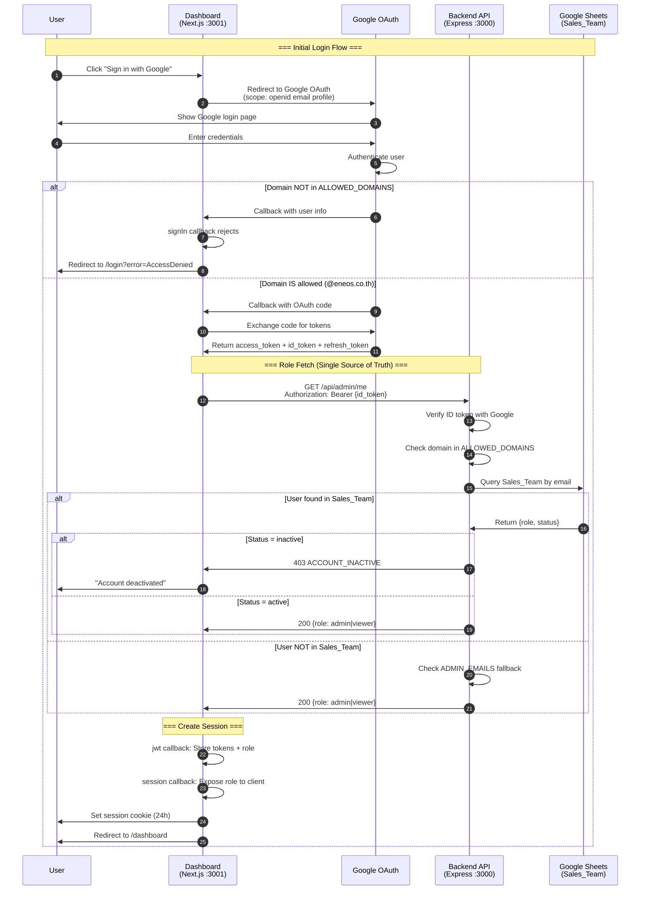
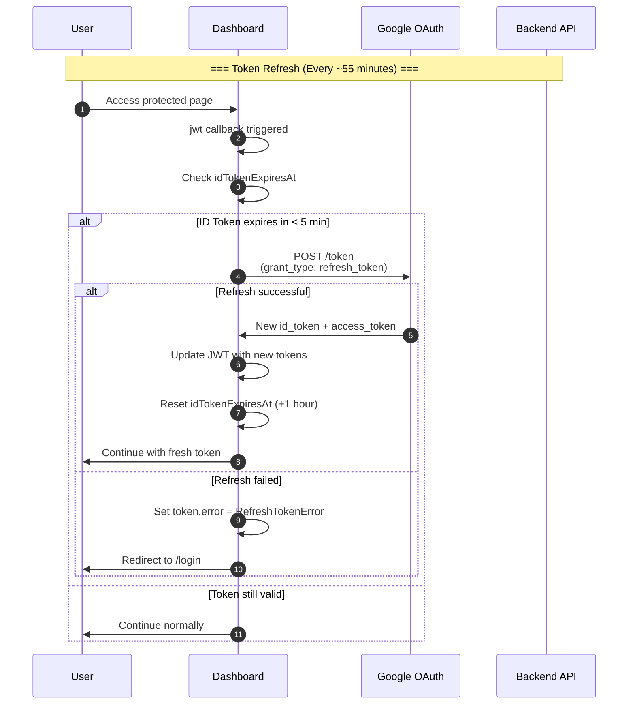
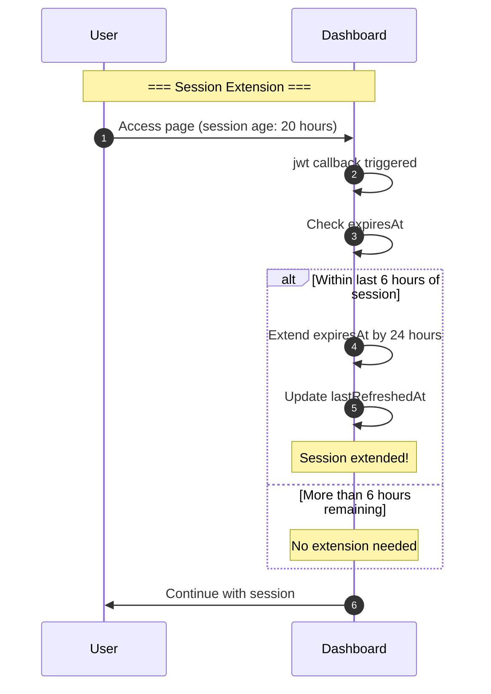
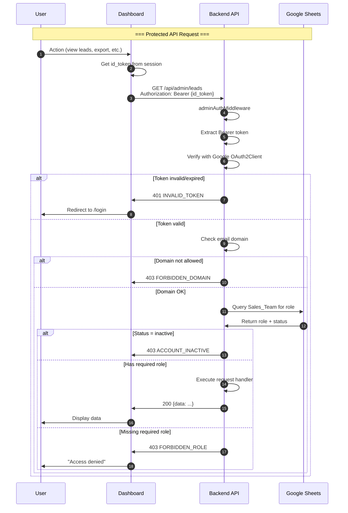
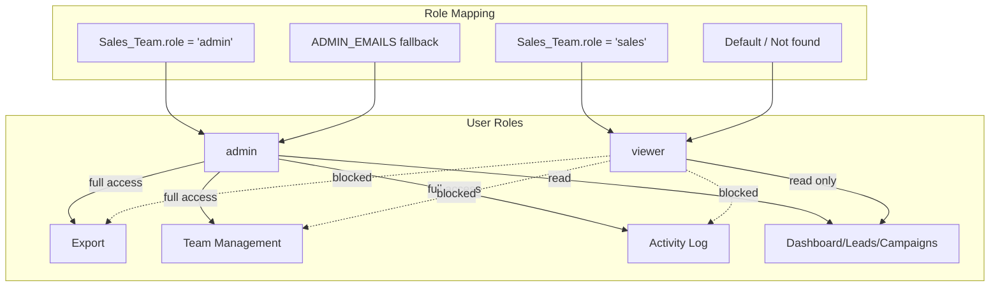

# Authentication Flow Diagram

**Project:** ENEOS Sales Automation
**Generated:** 2026-02-01
**Type:** Sequence Diagram

---

## Overview

This diagram shows the complete authentication flow between:
- **User** - End user (ENEOS employee)
- **Dashboard** - Next.js Admin Dashboard (:3001)
- **Google** - Google OAuth 2.0 + OpenID Connect
- **Backend** - Express.js API (:3000)
- **Sheets** - Google Sheets (Sales_Team table)

---

## Main Authentication Flow



---

## Token Refresh Flow

Google ID tokens expire after ~1 hour. This flow refreshes them automatically.



---

## Session Sliding Window

Session is 24 hours but extends automatically in the last 6 hours.



---

## API Request Authorization

Every protected API call follows this flow.



---

## Role-Based Access Control (RBAC)



---

## Security Checkpoints

| Checkpoint | Location | Check | Failure |
|------------|----------|-------|---------|
| 1. Domain | Dashboard `signIn` callback | Email domain in ALLOWED_DOMAINS | Reject login |
| 2. Domain | Backend `adminAuthMiddleware` | Email domain in ALLOWED_DOMAINS | 403 FORBIDDEN_DOMAIN |
| 3. Token | Backend `adminAuthMiddleware` | Valid Google ID token | 401 INVALID_TOKEN |
| 4. Status | Backend `getUserRole` | Sales_Team.status = 'active' | 403 ACCOUNT_INACTIVE |
| 5. Role | Backend `requireAdmin/requireViewer` | Has required role | 403 FORBIDDEN_ROLE |

---

## Token Lifecycle

| Token | Issued By | Lifetime | Storage | Refresh |
|-------|-----------|----------|---------|---------|
| **ID Token** | Google | ~1 hour | JWT cookie | Auto (refresh_token) |
| **Access Token** | Google | ~1 hour | JWT cookie | Auto (refresh_token) |
| **Refresh Token** | Google | Long-lived | JWT cookie | On consent |
| **Session** | NextAuth | 24 hours | JWT cookie | Sliding window (last 6h) |

---

## Environment Variables

### Dashboard (.env.local)
```bash
GOOGLE_CLIENT_ID=xxx.apps.googleusercontent.com
GOOGLE_CLIENT_SECRET=xxx
NEXTAUTH_SECRET=xxx
NEXTAUTH_URL=http://localhost:3001
ALLOWED_DOMAINS=eneos.co.th
NEXT_PUBLIC_API_URL=http://localhost:3000
```

### Backend (.env)
```bash
GOOGLE_OAUTH_CLIENT_ID=xxx.apps.googleusercontent.com
ALLOWED_DOMAINS=eneos.co.th
```

---

## Key Code References

| File | Purpose |
|------|---------|
| `dashboard/src/lib/auth.ts` | NextAuth configuration, token refresh, role fetch |
| `dashboard/src/middleware.ts` | Route protection |
| `backend/src/middleware/admin-auth.ts` | Token validation, RBAC middleware |
| `backend/src/services/sheets.service.ts` | Sales_Team queries |
