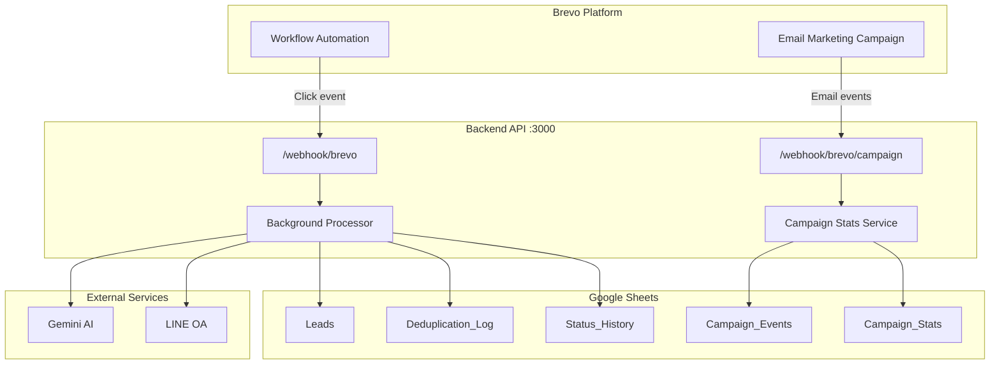
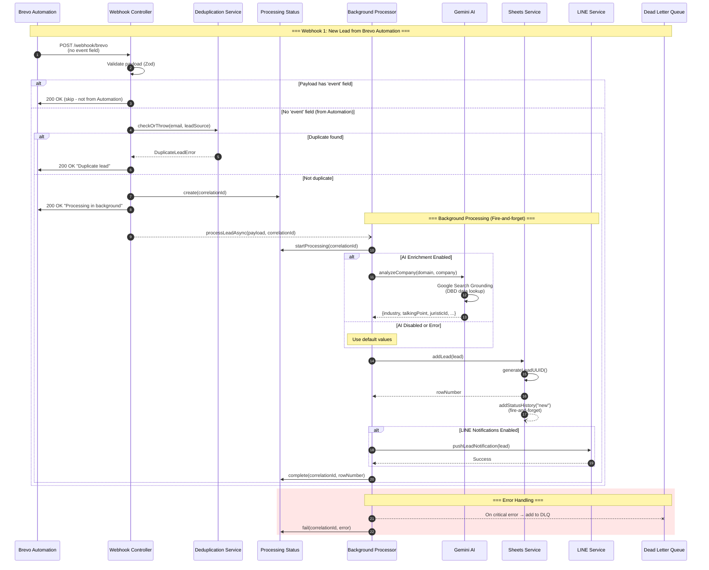
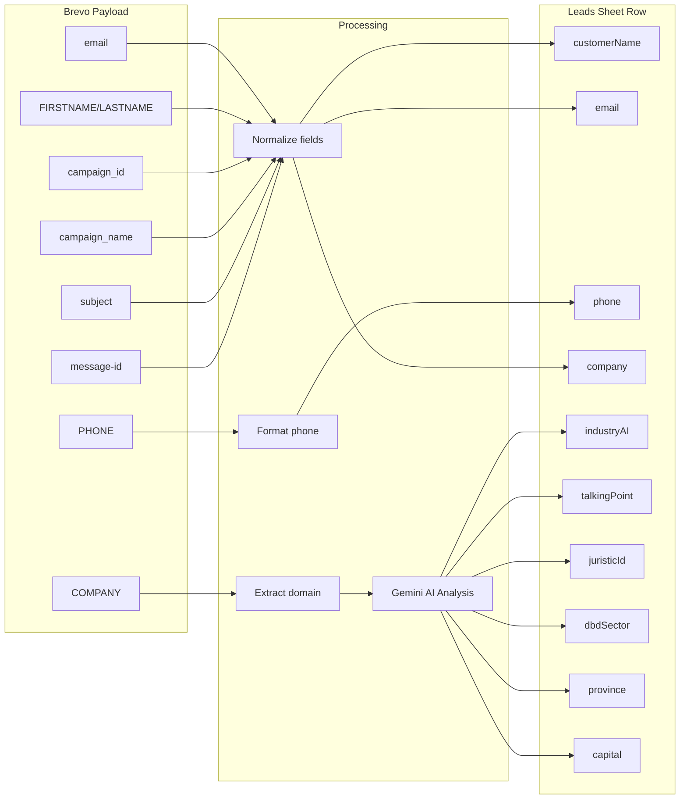
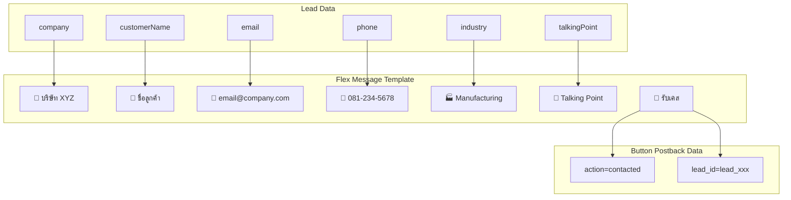
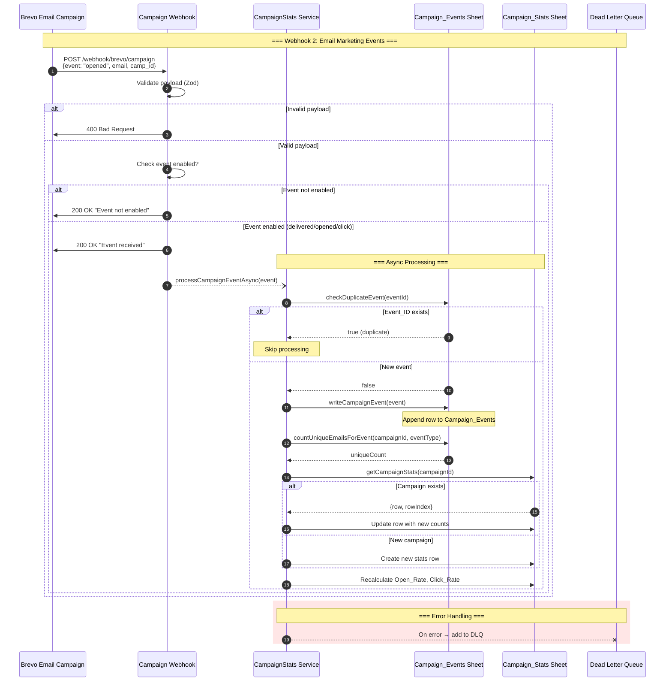
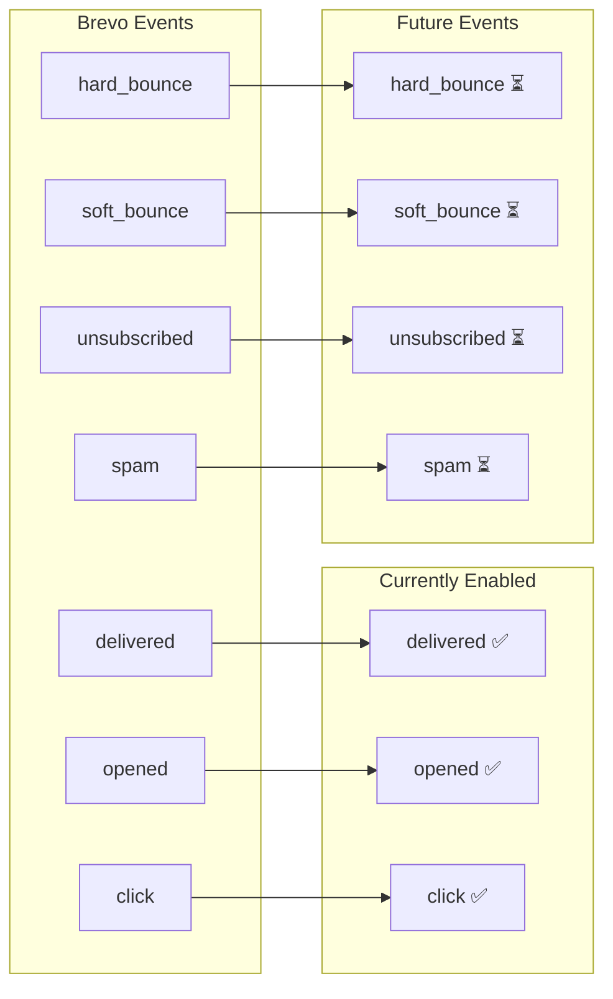
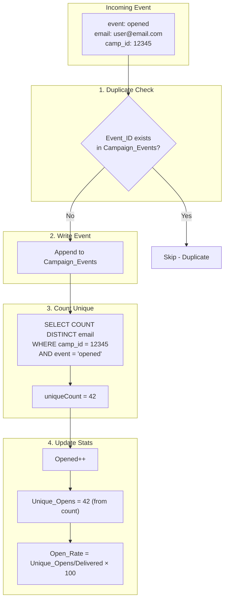
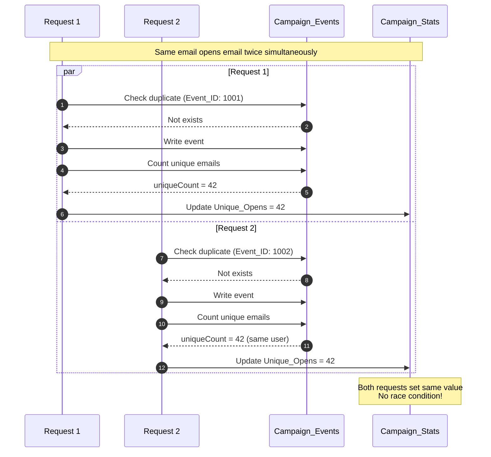

# Brevo Webhooks Data Flow

**Project:** ENEOS Sales Automation
**Generated:** 2026-02-01
**Type:** Data Flow Diagram

---

## Overview

ระบบรับ webhook จาก Brevo 2 ประเภท:

| Webhook | Endpoint | Trigger | Purpose |
|---------|----------|---------|---------|
| **Workflow Automation** | `POST /webhook/brevo` | User clicks link in email | Create new Lead |
| **Email Marketing** | `POST /webhook/brevo/campaign` | Email events | Track delivered/opened/click |

---

## Architecture Overview



---

## Webhook 1: Workflow Automation

**Endpoint:** `POST /webhook/brevo`
**Purpose:** สร้าง Lead ใหม่เมื่อ user คลิกลิงก์ใน email

### Sequence Diagram



### Data Transformation



### Gemini AI Enrichment

```mermaid
flowchart TD
    subgraph Input["Input"]
        D[Email Domain]
        C[Company Name]
    end

    subgraph Gemini["Gemini AI + Google Search Grounding"]
        G1[Extract company info]
        G2[DBD Lookup]
        G3[Industry Classification]
        G4[Generate Talking Point]
    end

    subgraph Output["CompanyAnalysis"]
        O1[industry: "Manufacturing"]
        O2[talkingPoint: "ENEOS..."]
        O3[website: "company.co.th"]
        O4[registeredCapital: "50 ล้านบาท"]
        O5[juristicId: "0105546012345"]
        O6[dbdSector: "MFG-A"]
        O7[province: "กรุงเทพมหานคร"]
        O8[fullAddress: "123 ถนน..."]
    end

    D --> G1
    C --> G1
    G1 --> G2
    G2 --> G3
    G3 --> G4

    G4 --> O1
    G4 --> O2
    G2 --> O3
    G2 --> O4
    G2 --> O5
    G2 --> O6
    G2 --> O7
    G2 --> O8
```

### LINE Flex Message



---

## Webhook 2: Email Marketing Campaign

**Endpoint:** `POST /webhook/brevo/campaign`
**Purpose:** Track email events (delivered, opened, click)

### Sequence Diagram



### Event Types



### Campaign Stats Update Flow



### Race Condition Prevention



**Key Insight:** ระบบใช้ **Count-after-Write** pattern แทน Increment:
- เขียน event ก่อน → นับ unique emails จาก sheet → set ค่าตรงๆ
- ไม่ใช่ `unique_count++` ที่มีปัญหา race condition

---

## Comparison: Two Webhooks

| Feature | Workflow Automation | Email Marketing |
|---------|---------------------|-----------------|
| **Endpoint** | `/webhook/brevo` | `/webhook/brevo/campaign` |
| **Trigger** | User clicks link | Email delivered/opened/clicked |
| **Has `event` field** | No | Yes |
| **Creates Lead** | Yes | No |
| **AI Enrichment** | Yes (Gemini) | No |
| **LINE Notification** | Yes | No |
| **Target Sheets** | Leads, Deduplication_Log, Status_History | Campaign_Events, Campaign_Stats |
| **Deduplication** | email + leadSource | Event_ID |

---

## Payload Examples

### Workflow Automation Payload

```json
{
  "email": "customer@company.co.th",
  "FIRSTNAME": "สมชาย",
  "LASTNAME": "ใจดี",
  "PHONE": "081-234-5678",
  "COMPANY": "บริษัท ทดสอบ จำกัด",
  "campaign_id": 12345,
  "campaign_name": "Q1 2026 Lubricant Promo",
  "subject": "พิเศษ! น้ำมันหล่อลื่น ENEOS",
  "message-id": "abc123",
  "contact_id": 98765,
  "date": "2026-02-01T10:30:00Z"
}
```

**Note:** ไม่มี `event` field = มาจาก Brevo Automation

### Email Marketing Payload

```json
{
  "event": "opened",
  "email": "customer@company.co.th",
  "id": 1001,
  "camp_id": 12345,
  "camp_name": "Q1 2026 Lubricant Promo",
  "date": "2026-02-01T10:35:00Z",
  "ts_event": 1706780100,
  "message-id": "abc123",
  "tag": "promo",
  "link": "https://eneos.co.th/products"
}
```

**Note:** มี `event` field = มาจาก Email Marketing Campaign

---

## Error Handling

### Dead Letter Queue

```mermaid
flowchart TD
    subgraph Webhook["Webhook Processing"]
        W1[Receive request]
        W2[Validate]
        W3[Process]
    end

    subgraph Error["Error Scenarios"]
        E1[Validation failed]
        E2[Sheets API error]
        E3[Gemini API error]
        E4[LINE API error]
    end

    subgraph DLQ["Dead Letter Queue"]
        D1[Store failed event]
        D2[Log error details]
        D3["GET /dlq → Review"]
        D4[Manual retry]
    end

    W1 --> W2
    W2 -->|Invalid| E1
    W2 -->|Valid| W3
    W3 -->|Sheets error| E2
    W3 -->|Gemini error| E3
    W3 -->|LINE error| E4

    E1 -->|400 response| END1[Return error]
    E2 --> D1
    E3 --> W3
    E4 --> W3

    Note right of E3: Gemini: Use defaults, continue
    Note right of E4: LINE: Log error, continue

    D1 --> D2
    D2 --> D3
    D3 --> D4
```

### Graceful Degradation

| Service | On Error | Behavior |
|---------|----------|----------|
| **Gemini AI** | API error | Use default values, continue |
| **LINE** | Push failed | Log error, continue (lead saved) |
| **Sheets** | API error | Add to DLQ, fail request |
| **Campaign Stats** | Stats update failed | Event already saved, log warning |

---

## Code References

| File | Purpose |
|------|---------|
| `src/controllers/webhook.controller.ts` | Workflow Automation webhook handler |
| `src/controllers/campaign-webhook.controller.ts` | Email Marketing webhook handler |
| `src/services/background-processor.service.ts` | Async lead processing |
| `src/services/campaign-stats.service.ts` | Campaign events & stats |
| `src/services/deduplication.service.ts` | Prevent duplicate leads |
| `src/services/gemini.service.ts` | AI enrichment |
| `src/services/line.service.ts` | LINE notifications |
| `src/validators/brevo.validator.ts` | Automation payload validation |
| `src/validators/campaign-event.validator.ts` | Campaign event validation |

### Key Functions

| Function | File | Purpose |
|----------|------|---------|
| `handleBrevoWebhook()` | webhook.controller.ts:30 | Main automation webhook |
| `handleCampaignWebhook()` | campaign-webhook.controller.ts:26 | Campaign events webhook |
| `processLeadInBackground()` | background-processor.service.ts:23 | Async lead processing |
| `recordCampaignEvent()` | campaign-stats.service.ts:91 | Event recording + stats |
| `analyzeCompany()` | gemini.service.ts | AI enrichment |
| `pushLeadNotification()` | line.service.ts | LINE Flex Message |

