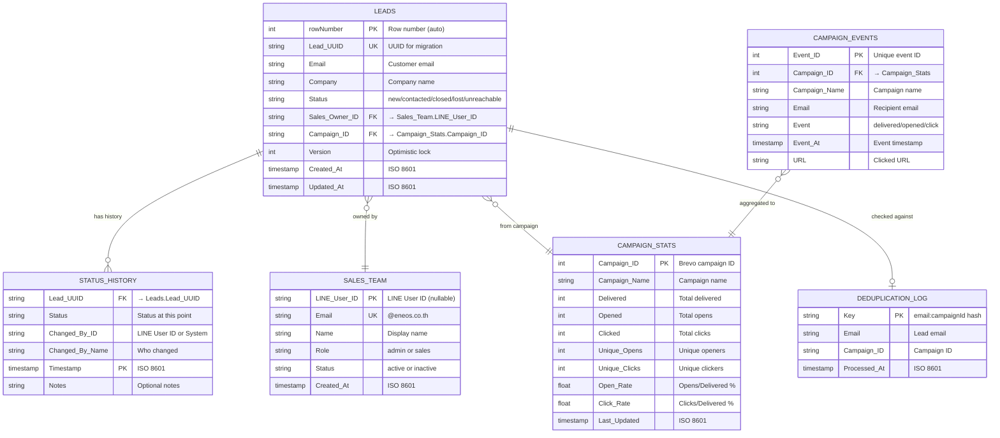

# Database Schema Diagram

**Project:** ENEOS Sales Automation
**Generated:** 2026-02-01
**Database:** Google Sheets (6 sheets)

---

## Overview

This system uses **Google Sheets as the primary database** instead of traditional SQL/NoSQL:

| Feature | Google Sheets Approach |
|---------|------------------------|
| Primary Key | Row number (auto-increment) |
| Foreign Key | Manual reference (Lead_UUID, Campaign_ID) |
| Transactions | Not supported (use retry + circuit breaker) |
| Locking | Optimistic locking via Version column |
| Indexes | No native indexes (full scan required) |

---

## Entity Relationship Diagram



---

## Sheet Details

### 1. Leads (Main Database)

**Columns:** 34 (A-AH)
**Purpose:** Core lead data with sales tracking


**Column Groups:**

| Group | Columns | Purpose |
|-------|---------|---------|
| **Identity** | A-E | Customer info (Date, Name, Email, Phone, Company) |
| **AI Enrichment** | F-H | Gemini AI data (Industry, Website, Capital) |
| **Status** | I-K | Lead status and owner |
| **Campaign** | L-N | Brevo campaign info |
| **Tracking** | O-R | Source and event tracking |
| **Timestamps** | S-V | Status change timestamps |
| **System** | W | Version for optimistic locking |
| **Brevo Attrs** | X-Z | Additional Brevo contact attributes |
| **UUID Migration** | AA-AD | For future Supabase migration |
| **DBD Grounding** | AE-AH | Google Search grounding data |

---

### 2. Sales_Team

**Columns:** 7 (A-G)
**Purpose:** User management and authentication


**Role Mapping:**

| Sheet Value | Dashboard Role | Permissions |
|-------------|----------------|-------------|
| `admin` | Admin | Full access (export, team management) |
| `sales` | Viewer | Read-only access |

**User Types (Story 7-4b):**

| Type | LINE_User_ID | Email | How Created |
|------|--------------|-------|-------------|
| LINE Account | Not null | Null | Auto from LINE postback |
| Dashboard Member | Null | Not null | Manual creation |
| Linked Member | Not null | Not null | Linked after creation |

---

### 3. Status_History (Audit Log)

**Columns:** 6 (A-F)
**Purpose:** Track all status changes for leads


**Write Pattern:** Fire-and-forget (async, non-blocking)

```typescript
// Non-blocking history write
this.addStatusHistory({...}).catch(err => logger.error(err));
```

---

### 4. Deduplication_Log

**Columns:** 4 (A-D)
**Purpose:** Prevent duplicate leads from same email + campaign


**Key Generation:**
```typescript
const key = `${email.toLowerCase()}:${campaignId}`;
```

---

### 5. Campaign_Events (Brevo Events)

**Columns:** 11 (A-K)
**Purpose:** Raw event log from Brevo webhooks


**Event Types:**
- `delivered` - Email delivered
- `opened` - Email opened
- `click` - Link clicked

---

### 6. Campaign_Stats (Aggregates)

**Columns:** 15 (A-O)
**Purpose:** Aggregated campaign metrics for dashboard


**Rate Calculations:**
```
Open_Rate = (Unique_Opens / Delivered) * 100
Click_Rate = (Unique_Clicks / Delivered) * 100
```

---

## Relationships Diagram


---

## Data Flow


---

## Optimistic Locking


---

## Key Constraints

| Constraint | Sheet | Column(s) | Enforcement |
|------------|-------|-----------|-------------|
| Primary Key | Leads | rowNumber | Auto (row position) |
| Unique | Leads | Lead_UUID | Application-level |
| Unique | Deduplication_Log | Key | Application check before insert |
| Unique | Campaign_Events | Event_ID | Application-level |
| Unique | Campaign_Stats | Campaign_ID | Application-level |
| Foreign Key | Status_History | Lead_UUID | Application-level (no cascade) |
| Foreign Key | Leads | Sales_Owner_ID | No enforcement (orphan allowed) |

---

## Migration Notes (Supabase)

When migrating to Supabase:

| Google Sheets | Supabase |
|---------------|----------|
| Row number | `id` (serial) |
| Lead_UUID | `id` (uuid, primary key) |
| Version | `updated_at` + RLS |
| No indexes | Proper indexes on Email, Campaign_ID |
| Sheet tabs | Separate tables |

**UUID Ready Fields:**
- `Lead_UUID` - Already generated for new leads
- `Created_At` / `Updated_At` - ISO 8601 timestamps
- `Contacted_At` - For metrics calculation

---

## Code References

| File | Purpose |
|------|---------|
| `src/services/sheets.service.ts` | All CRUD operations |
| `src/types/index.ts` | TypeScript interfaces |
| `src/config/index.ts` | Sheet names configuration |

### Key Functions

| Function | Purpose |
|----------|---------|
| `addLead()` | Insert new lead (generates UUID) |
| `getRow()` | Get lead by row number |
| `updateLeadWithLock()` | Update with optimistic locking |
| `claimLead()` | Claim lead (race condition safe) |
| `checkDuplicate()` | Check Deduplication_Log |
| `addStatusHistory()` | Fire-and-forget audit log |
| `getAllSalesTeamMembers()` | Get Sales_Team with filters |

