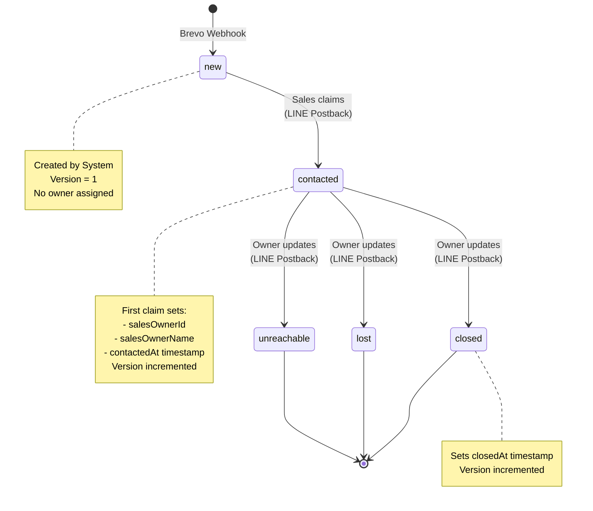
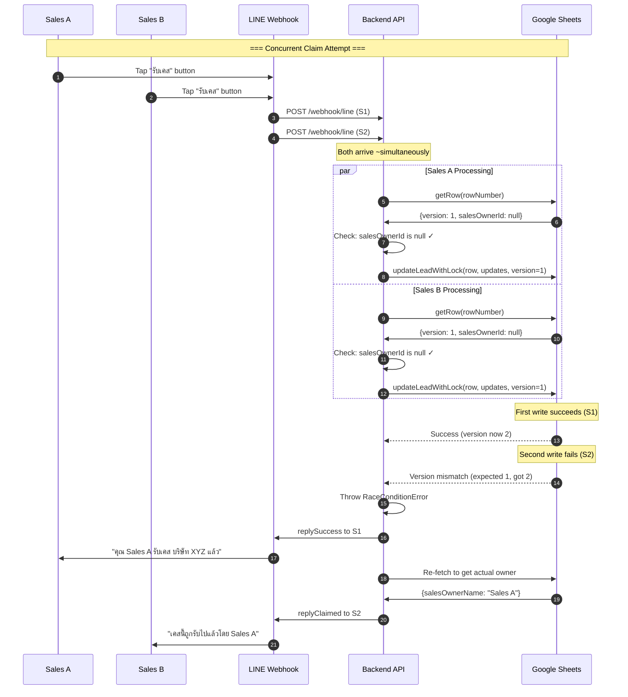
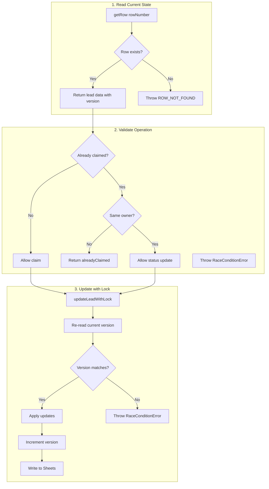
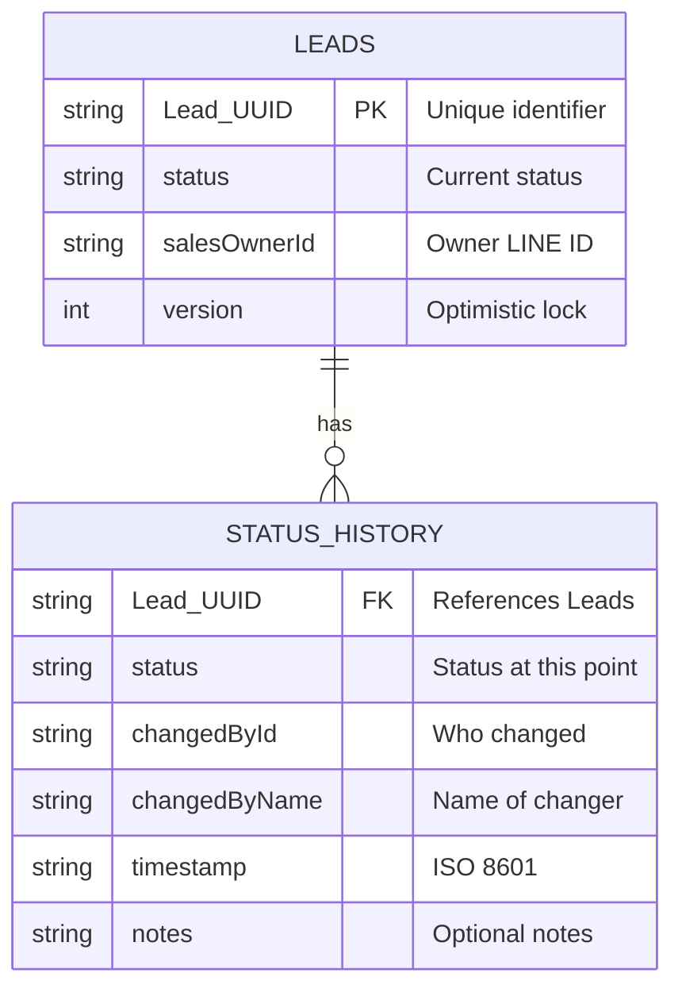

# Lead State Machine Diagram

**Project:** ENEOS Sales Automation
**Generated:** 2026-02-01
**Type:** State Machine Diagram

---

## Overview

This diagram shows the complete lead status lifecycle, including:
- All valid states
- Allowed transitions
- Who can trigger each transition
- Race condition handling
- Optimistic locking mechanism

---

## Lead Status Values

| Status | Description | Thai Name |
|--------|-------------|-----------|
| `new` | Lead just created from Brevo webhook | ใหม่ |
| `contacted` | Sales claimed the lead | ติดต่อแล้ว |
| `closed` | Successfully closed the sale | ปิดการขาย |
| `lost` | Lost the sale (customer declined) | เสียโอกาส |
| `unreachable` | Could not reach the customer | ติดต่อไม่ได้ |

---

## State Machine Diagram



---

## Transition Matrix

| From | To | Triggered By | Validation |
|------|----|--------------| -----------|
| (none) | `new` | System (Brevo Webhook) | Deduplication check |
| `new` | `contacted` | Any Sales (LINE) | Race condition check |
| `contacted` | `closed` | Owner only | Must be salesOwnerId |
| `contacted` | `lost` | Owner only | Must be salesOwnerId |
| `contacted` | `unreachable` | Owner only | Must be salesOwnerId |

**Important Notes:**
- Only the **owner** can update status after claiming
- Non-owners attempting to claim get "มีคนรับเคสนี้ไปแล้ว" (Already claimed)
- Status changes are **irreversible** in the current implementation

---

## Race Condition Handling



---

## Optimistic Locking Flow



---

## Status History Audit Trail

Every status change is recorded in the `Status_History` sheet.



### What Gets Logged

| Event | Status | Changed By | Notes |
|-------|--------|------------|-------|
| Lead created | `new` | System | "Lead created from webhook" |
| Sales claims | `contacted` | Sales name | (empty) |
| Close sale | `closed` | Sales name | (empty) |
| Lose sale | `lost` | Sales name | (empty) |
| Unreachable | `unreachable` | Sales name | (empty) |

### Fire-and-Forget Pattern

Status history writes are **asynchronous** and non-blocking:

```typescript
// From sheets.service.ts
this.addStatusHistory({
  leadUUID: enrichedLead.leadUUID,
  status: 'new',
  changedById: 'System',
  changedByName: 'System',
  timestamp: now,
  notes: 'Lead created from webhook',
}).catch((err) => {
  // Log but don't throw - main operation continues
  logger.error('Failed to record status history', { error: err });
});
```

---

## Timestamp Tracking

| Timestamp | Set When | Purpose |
|-----------|----------|---------|
| `createdAt` | Lead created | Track lead age |
| `contactedAt` | First claim (contacted) | Calculate Response Time |
| `closedAt` | Status → closed | Calculate Closing Time |
| `lostAt` | Status → lost | Track lost date |
| `unreachableAt` | Status → unreachable | Track unreachable date |
| `updatedAt` | Any update | Last modification |

### Metric Calculations

```
Response Time = contactedAt - createdAt
Closing Time = closedAt - contactedAt
Lead Age = now - createdAt
```

---

## LINE Postback Data Format

Postback data sent from LINE Flex Message buttons:

### Legacy Format (row-based)
```
action=contacted&row_id=42
```

### New Format (UUID-based)
```
action=contacted&lead_id=lead_550e8400-e29b-41d4-a716-446655440000
```

### Supported Actions
- `contacted` - Claim the lead
- `closed` - Mark as closed
- `lost` - Mark as lost
- `unreachable` - Mark as unreachable

---

## Error Handling Summary

| Error | HTTP | LINE Reply | Cause |
|-------|------|------------|-------|
| `ROW_NOT_FOUND` | 404 | "ไม่พบข้อมูลเคสนี้ในระบบ" | Row deleted or invalid |
| `RaceConditionError` | 409 | "มีคนรับเคสนี้ไปแล้วโดย {name}" | Version mismatch |
| Invalid postback | 200 | "ข้อมูลไม่ถูกต้อง" | Malformed data |
| Unknown error | 500 | "เกิดข้อผิดพลาด กรุณาลองใหม่" | Unexpected error |

---

## Key Code References

| File | Purpose |
|------|---------|
| `src/services/sheets.service.ts` | Lead CRUD, optimistic locking, status history |
| `src/controllers/line.controller.ts` | LINE postback handling, race condition detection |
| `src/types/index.ts` | `LeadStatus` type, `VALID_LEAD_STATUSES` constant |
| `src/validators/line.validator.ts` | Postback data parsing |

### Critical Functions

| Function | Location | Purpose |
|----------|----------|---------|
| `claimLead()` | sheets.service.ts:357 | Claim lead with race condition check |
| `updateLeadStatus()` | sheets.service.ts:457 | Update status (owner only) |
| `updateLeadWithLock()` | sheets.service.ts:293 | Optimistic locking implementation |
| `addStatusHistory()` | sheets.service.ts:1330 | Audit log (fire-and-forget) |
| `processLineEvent()` | line.controller.ts:98 | Postback event handler |

